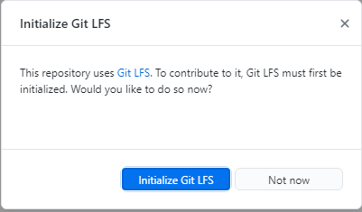
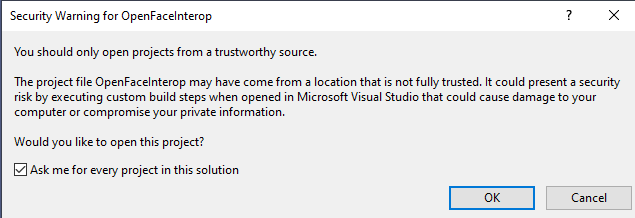
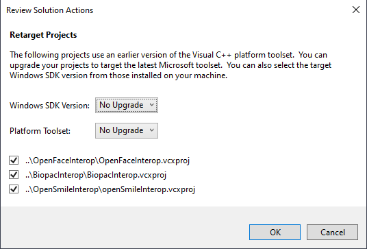

# How to build the WPF application

## Dependencies

The WPF application project references all available OpenSense components at default.
So you need to satisfy all the prerequisites to successfully build and run the application.

A set of minimal dependencies is provided as comment in the `.csproj` file.
You can replace the project reference list with references in the comment.

## Environment

+ Windows x64

## Prerequisites

+ Visual Studio 2022
  + Desktop development with C++ (Workload)
  + .NET desktop development (Workload)
  + .NET Framework 4.8 SDK (Individual Component)
  + .NET Framework 4.8 targeting pack (Individual Component)
  + .NET 8.0 Runtime (Individual Component)
  + MSVC v141 - VS 2017 C++ x64/x86 build tools (Individual Component) (if you want to compile OpenFace and openSMILE)
  + Windows 11 SDK (10.0.26100)
+ [Kinect for Windows SDK 2.0](https://www.microsoft.com/en-us/download/details.aspx?id=44561) (if you want to run KinectV2)
+ CUDA enabled GPU (if you want to run OpenPose)
+ [GitHub Desktop](https://desktop.github.com/) (optional)

## Clone

Please clone this repository with [GitHub Desktop](https://desktop.github.com/), or a git client with Git Large File Storage ([Git LFS](https://git-lfs.github.com/)) extension installed.

If you clone this repository by downloading a zip file, some files will be replaced by placeholder files, which may lead to build failure.
If you clone by a git client without Git LFS extension, the clone process will report an error.

Click `Initialize Git LFS` if this window pops out.

## Build

Open the file `OpenSense.sln` with Visual Studio.

You may see security warnings like this.

*This may because this VS solution contains native C++ projects.*

If a retarget dialog is shown, select `No Upgrade` for all.

*We once upgraded them to VS 2019 Toolset, but found some native functions did not work.*

Select project `WpfApplication` and set it to be the startup project (by right click on it and click `Set as Startup Project`).

Then you can build the solution.

## Run

Once you successfully build OpenSense, you may run it.

You need to install Kinect SDK, if you see a runtime error like this.

